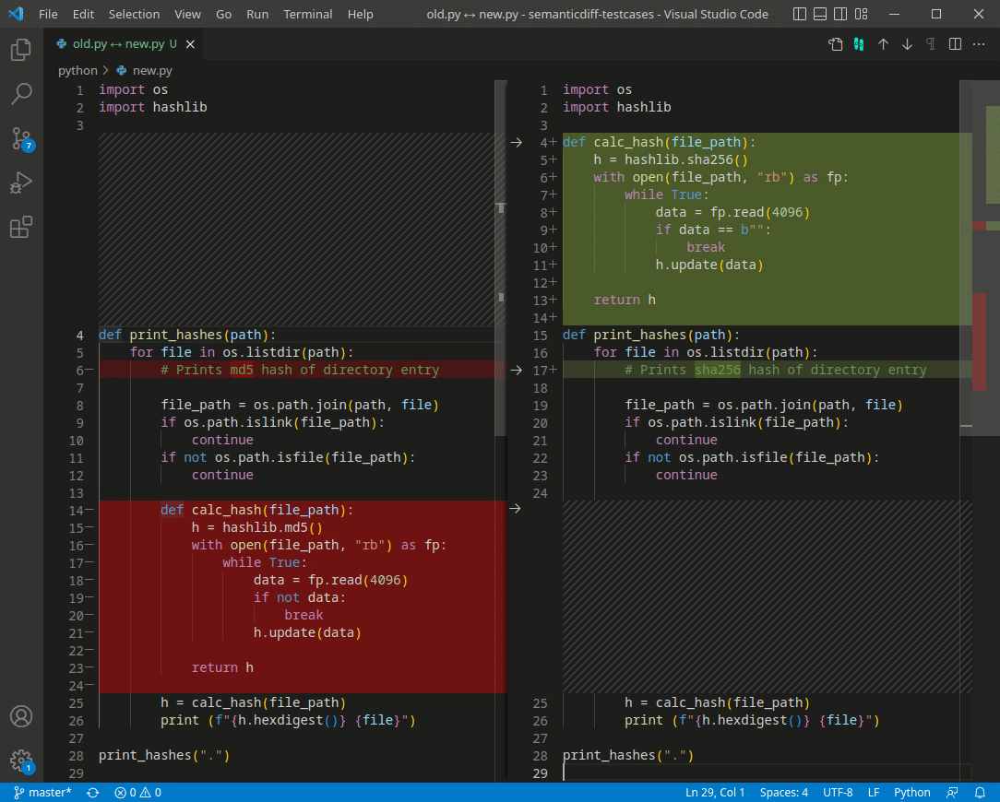

#  SemanticDiff

> SemanticDiff is a programming language aware diff for Visual Studio Code and GitHub. It helps you understand code changes faster by removing noise and adding useful annotations.

This repository is mainly used for bug reports and community discussions. If you want to learn more about the VS Code extension or GitHub App, visit [semanticdiff.com](https://semanticdiff.com).

## Contents

* [Reporting Bugs](#reporting-bugs)
  - [Sharing of Source Code in a Bug Report](#sharing-of-source-code-in-a-bug-report)
* [Requesting Features](#requesting-features)
* [Questions and Discussions](#questions-and-discussions)

## Reporting Bugs
If you encounter a bug while using SemanticDiff, please let us know!

Before opening a bug report, please make sure that you are using the latest version of SemanticDiff. In the case of the VS Code extension, check that the version shown in the extenion tab matches the one displayed in the [VS Marketplace](https://marketplace.visualstudio.com/items?itemName=semanticdiff.semanticdiff). Users of the GitHub App should check if the problem persists after a force reload of the page to rule out issues related to an outdated browser cache.

To open a bug report, go to our [issues](https://github.com/Sysmagine/SemanticDiff/issues) page, click `New Issue` and select the `Bug Report (GitHub App)` or `Bug Report (VS Code)` template. Please fill in as much information as possible, especially the following:

* A short, descriptive title
* Steps how you triggered the bug
* A description of what you think is broken (ideally with a screenshot)
* (VS Code only): Information about your SemanticDiff and VS Code version

If the bug is related to the diff of a specific source code, be sure to provide the code needed to reproduce the problem. You can either attach the old and new source code files or provide a link to the change in our GitHub App, if the code is publicly accessible.

### Sharing of Source Code in a Bug Report

❗️ **Ensure that you are legally authorized to share the source code before you proceed!**

Please always include source code as text, **not as a screenshot**! If your code is too large for a snippet, you can either attach it as a file (you may need to change the file extensions to .txt) or link to the files (e.g. using a [GitHub Gist](https://gist.github.com/)).

If you can't share the entire old and new file, we suggest creating a minimal example. Copy the old and new content into separate files and remove everything not in proximity to the bug. Please make sure that the issue can still be reproduced with your stripped down source code. You can do this with our VS Code extension by right-clicking on the old file, then clicking on `Select for Compare`. Afterwards right-click on the new file and click on `Compare With Selected`. Now switch to SemanticDiff by clicking on the icon in the top right corner and verify that the bug is still reproducible.

## Requesting Features

We are also very happy to receive ideas on how we can make SemanticDiff even better. To submit a feature request, go to our [issues](https://github.com/Sysmagine/SemanticDiff/issues) page, click on `New Issue` and select the `Feature Request (GitHub App)` or `Feature Request (VS Code)` template.

To help us understand your proposal, please share:

* If your feature is related to a specific problem you're trying to solve
* What your ideal solution would look like
* And if there are any alternatives to the feature you propose. E.g., if its related to the problem, are there any workarounds? Are there less generic solutions that would also solve the issue? Etc.

## Questions and Discussions

If you have a question regarding the use of SemanticDiff or if you would like to participate in discussions and polls, check our [discussions](https://github.com/Sysmagine/SemanticDiff/discussions) page. We look forward to welcoming you to our community. 😊️

---
*SemanticDiff is a product by Sysmagine GmbH based in Heidelberg, Germany ([Impressum](https://semanticdiff.com/impressum/)).*
