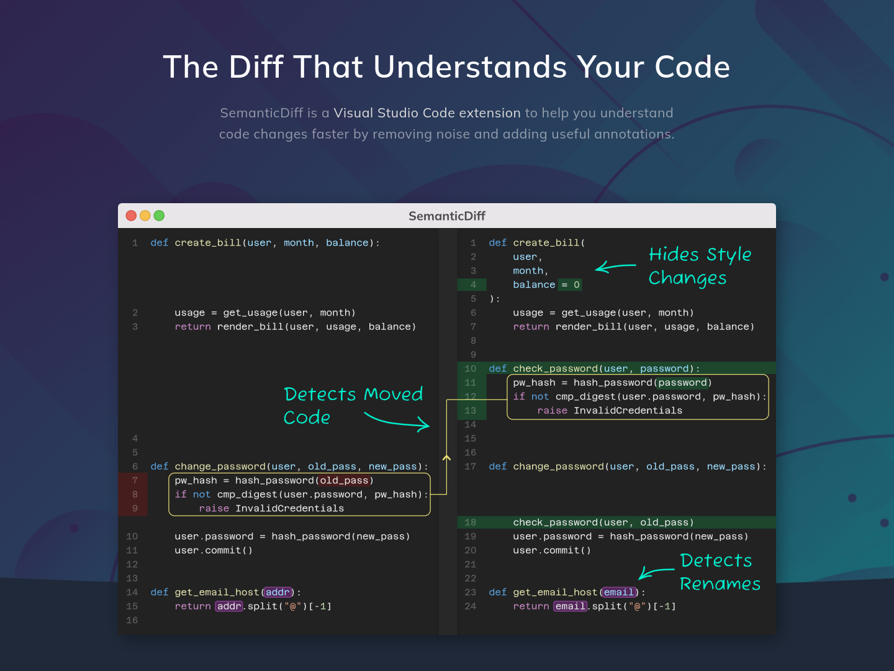

#  SemanticDiff

> SemanticDiff is a programming language aware diff for Visual Studio Code. It helps you understand code changes faster by removing noise and adding useful annotations.

This repository is mainly used for community discussions and bug reports. If you want to know more about the extension, visit [semanticdiff.com](https://semanticdiff.com).

## Reporting Issues

If you encounter a bug while using SemanticDiff (the online demo or the VS code extension), please create a new issue with the following information:

* A short, descriptive title
* A description of what you think is broken (ideally with a screenshot)
* Steps how you triggered the bug
* Information about your VS Code version, if applicable: `Help -> About -> Copy`

For issues related to the visual diff also include:
* The old and new source code files triggering the issue (as text, not as screenshot)

## Sharing of Source Code

Fixing an issue that we can not reproduce is incredible hard. We therefore may need a copy of the old and new code that triggered your issue.

If you can't share the entire old and new file, we suggest creating a minimal example by removing everything not in proximity to the bug. You can use our [online demo](https://semanticdiff.com/#demo) to verify that your example still reproduces the issue.
